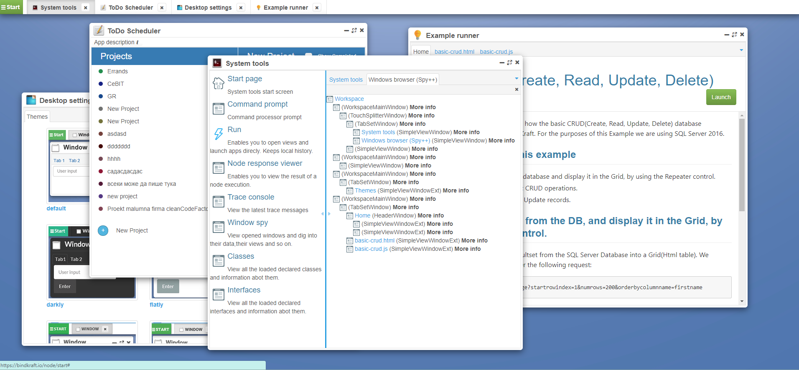
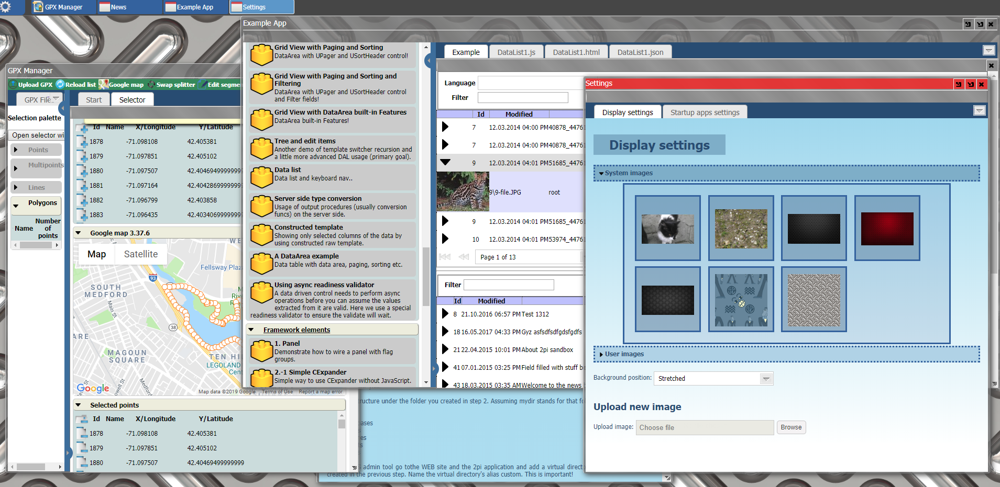
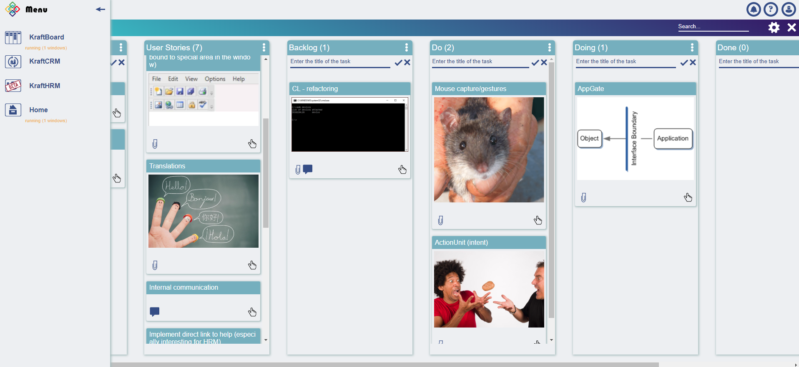

# BindKraft Javascript platform

This repository contains the source code and the documentation of the BindKraft Javascript platform (`BindKraftJS`) for use in WEB browser environment. BindKraftJS can potentially run on top of a variety of WEB servers - from rudimentary ones serving static content only to complex especially designed to integrate with it, like [CoreKraft](https://github.com/Cleancodefactory/CoreKraft).

## Links

Project information | Documentation | Sites
--- | --- | ---
[Changelog](Documentation/CHANGELOG.md) - Changes log, started in April 2019 (see more details in the document) | [Open the documentation](Documentation/start.md) | [BindKraft.com](http://bindkraft.com) - KraftApps (A workspace with several apps written with BindKraft sitting on top of a CoreKraft server)
[Roadmap](Documentation/ROADMAP.md) - Future plans| . | [BindKraft.io](http://bindkraft.io) - Demo site (quite old)

## BindKraftJS at a glance

> `Basically BindKraftJS adapts the desktop paradigm to the WEB page`

BindKraft sees WEB pages differently - not as SPA (single page apps) or pages from an application consisting of many, but as a `desktop`. For BindKraft a WEB page is a `workspace` where a number of separate apps open, close (possibly many times and one or more instances simultaneously), communicate between themselves and so on. The user works on the page in a manner very similar to the way the user interacts with desktop applications - each app consists of windows (actually formed with DOM techniques) - one or more, they can overlap each other in a very desktopy way, or can be designed to look like a typical WEB site, but still function as windows behind the scenes. 

Three screenshots from different designs are shown above.

BindKraft as a whole is a philosophy going beyond the client side - the desktop-like usage of the WEB pages. This includes servers (_serving the site or just providing services_) that integrate tightly with the client BindKraftJS ,formats for this communication and others.

One of the interesting concepts for integration between both the client side (this one) and the server side ([CoreKraft](https://github.com/Cleancodefactory/CoreKraft) for instance) are the `NodeSets` - mechanism that enables the programmer to describe the server data (residing in one or more databases) as trees (usually following the relations naturally originating from the data schemas) and then requesting/querying them and writing them back in parts or as while with many times less coding required than in a typical application following the RESTful pattern/standard.

BindKraftJS does not require all those features from a server, the integration is a matter of optional components (mostly classes) inheriting from the basic ones, which are more general in nature. So, an effective desktops with sets of apps can be created with BindKraftJS on all kinds of servers, but the more specialized ones will bring to the table amazing ways to save time and effort in wide variety of cases.

### It is a different platform and not a framework

**BindKraftJS is the path most other Javascript creations did not take**. In the beginning it happened by accident, but the benefits it brought were enough to get us serious about it - first for internal use (from 2011) and now openly as open source projects.

While virtually all modern frameworks still follow a pattern that emerged from the classic WEB applications from the 90-s, BindKraft breaks out of the old concepts, because they were born by Internet where Javascript and any serious client side programming was wither too limited or too risky from compatibility point of view. If one looks behind even in (let say) 2010 the WEB browsers were more than ready for a general change of the way we are using them - leaving the page-to-page "navigation" to become a secondary concern and embracing approaches then seen as suitable for desktop applications only. Even today the navigation still rotates around the page-to-page concept even when the application lives on a single page. BindKraft intentionally evolved in different direction, but includes support for history and url navigation simulation - to keep the search engines happy and give the users some intuitive options. Still, these are the secondary concerns and not the only way to build well-designed applications with BindKraft.

Today, with the cloud computing becoming mainstream, WEB based apps taking over more and more of their desktop counterparts it is simply convenient to have a platform where, in the same programming environment, one can build both kinds of apps any business needs - the ones that serve its employees in their work and the ones facing the clients. Everybody knows that they differ in what's more important for each kind, but if they can naturally grow in the same soil, the integration of the data and data services involved can save enormous amounts of effort.

### A few hints how things look inside (for first time visitors)

> BindKraftJS uses `prototype` to define OOP constructs

> BindKraftJS does not run away from the non-strict typing - it embraces the thing, but introduces advanced typing techniques where needed

> BindKraftJS marries the `class` and `interface` concepts with the `non-typed` nature of the classic Javascript

> BindKraftJS expects the UI code to blend in the DOM and act as an extended layer and not stay aside forcibly acting in one predetermined role only (take MVC for example)

> BindKraftJS recognizes the fact that the HTML DOM is a base, but not an ultimate solution by itself and defines higher level UI constructs and abstractions for all cases when "blending with DOM" is not enough.

